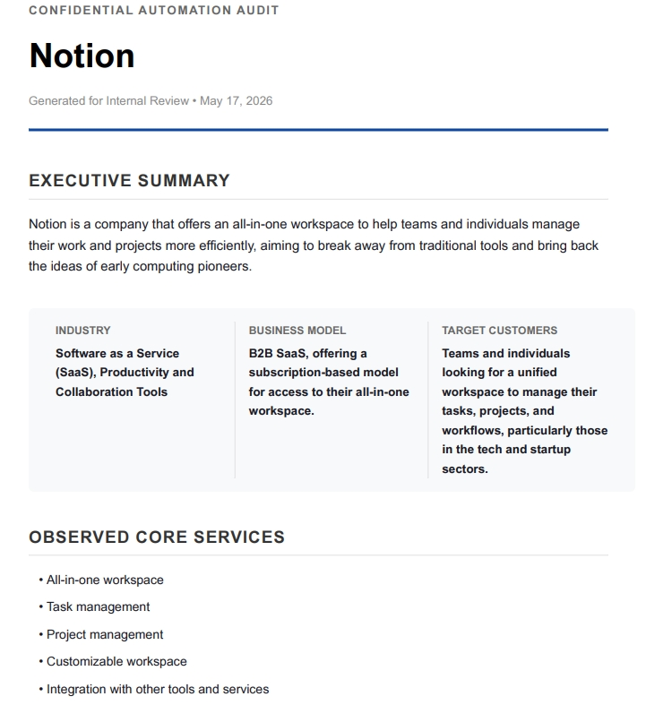
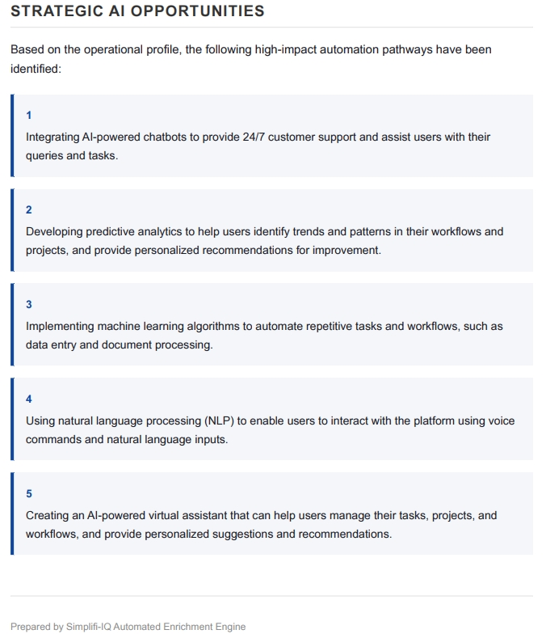
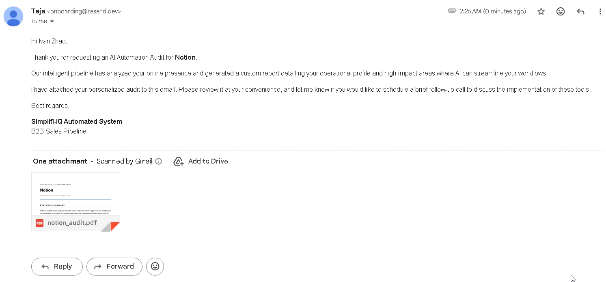

# Simplifi-IQ: Automated AI Audit Pipeline

## I. Project Overview

An asynchronous backend prototype designed to automate the B2B lead follow-up workflow. The system captures form submissions, enriches company data via web scraping and the Groq API (Llama 3), compiles a custom business insights audit into a WeasyPrint PDF, and dispatches the final report to the prospect via email without human intervention.

## II. System Architecture & Workflow

The application executes a strictly typed, asynchronous pipeline. To prevent blocking the client during heavy I/O operations (web scraping and LLM inference), the API immediately returns a `202 Accepted` response and delegates the core processing to a background worker. 

A centralized SQLite state machine tracks the payload through five distinct execution phases, ensuring fault tolerance and clear observability if a third-party service fails.

### The State Machine Lifecycle

1. **RECEIVED:** FastAPI validates the incoming JSON payload against Pydantic schemas and initializes a new database record.
2. **SCRAPED:** The data acquisition service extracts raw text from the target URL, falling back to DOM parsing if standard extraction fails.
3. **ENRICHED:** The Groq API (Llama 3.3 70B) synthesizes the unstructured text into a strictly enforced JSON schema.
4. **GENERATED:** WeasyPrint merges the LLM JSON data into an HTML template and compiles the final PDF binary.
5. **DELIVERED:** The Resend API dispatches the email, while Google Workspace integrations handle remote archiving and telemetry logging.

### Data Flow Diagram

```mermaid
graph TD
    %% Client to API
    Client[Client / Webhook] -->|POST /api/leads| Gateway(FastAPI Router)
    
    %% Synchronous vs Asynchronous Boundary
    subgraph CoreEngine [Core Engine (Async Worker)]
        Gateway -->|1. Initialize Row| DB[(SQLite DB)]
        Gateway -->|2. Delegate Task| Queue[Background Tasks]
        
        Queue -->|3. Extract Text| Scraper[Scraper Service]
        Scraper -->|Trafilatura / BS4| Scraper
        
        Queue -->|4. Structure Data| LLM[Groq LLM]
        LLM -->|JSON Object Mode| LLM
        
        Queue -->|5. Compile Asset| PDF[WeasyPrint Engine]
        
        Queue -->|6. Dispatch| Delivery[Delivery Router]
    end

    %% State Tracking Updates
    Scraper -.->|Update: SCRAPED| DB
    LLM -.->|Update: ENRICHED| DB
    PDF -.->|Update: GENERATED| DB
    Delivery -.->|Update: DELIVERED| DB

    %% External Systems
    Delivery -->|Email| Resend[Resend API]
    Delivery -->|Archive| Drive[Google Drive]
    Delivery -->|Log| Sheets[Google Sheets]
```
## III. Setup Instructions

### Prerequisites
Ensure your local development environment meets the following system requirements before proceeding:

* **Python 3.11+**: Required for `asyncio` background tasks and strict typing features.
* **Git**: To clone the repository.
* **GTK3 Runtime**: A strict system-level dependency required by the WeasyPrint engine to render PDFs.
  * *Windows*: Download the GTK3 installer and ensure it is added to your system `PATH`.
  * *macOS*: Run `brew install pango`.
  * *Linux (Debian/Ubuntu)*: Run `sudo apt-get install libpango1.0-dev`.

### Installation

Follow these steps to set up the pipeline locally.

**1. Clone the repository**
```bash
git clone [https://github.com/Teja3993/ai-audit-pipeline.git](https://github.com/Teja3993/ai-audit-pipeline.git)
cd simplifi-iq-audit
```

**2. Create and activate a virtual environment**
Isolating the dependencies ensures the project does not conflict with your global Python installation.

*On Windows:*
```bash
python -m venv venv
venv\Scripts\activate
```

*On macOS / Linux:*
```bash
python3 -m venv venv
source venv/bin/activate
```

**3. Install dependencies**
Install all required libraries, including FastAPI, WeasyPrint, and the Google API clients.
```bash
pip install -r requirements.txt
```
### Environment Configuration

The application uses Pydantic to strictly validate environment variables on startup. Create a `.env` file in the root directory of the project and populate it with the following keys:

| Variable | Status | Description |
| :--- | :--- | :--- |
| `GROQ_API_KEY` | **Required** | Authenticates the Groq client for Llama-3.3 LLM inference. |
| `RESEND_API_KEY` | **Required** | Authenticates the Resend client for email delivery. |
| `GOOGLE_SHEET_ID` | Optional | Target spreadsheet ID for logging pipeline telemetry. |
| `GOOGLE_DRIVE_FOLDER_ID` | Optional | Target folder ID for PDF archiving. |

**Google Workspace Credentials**
In addition to the `.env` file, Google integrations require a valid service account. Place your `service_account.json` file directly in the project root. If this file is omitted, the pipeline gracefully bypasses the Google Workspace logging steps without crashing.

### Running the Server

With the environment configured and dependencies installed, start the local ASGI server using Uvicorn. The `--reload` flag enables hot-reloading for local development.

```bash
uvicorn app.main:app --reload
```

By default, the server runs on port `8000`. FastAPI automatically generates an interactive OpenAPI (Swagger) interface. 

Navigate to the following URL in your web browser to view the documentation and manually test the ingestion endpoint:
* **Interactive API Docs (Swagger UI):** [http://localhost:8000/docs](http://localhost:8000/docs)

## IV. Usage & End-to-End Demo

### 1. Sample Payload

The pipeline expects a strict JSON payload. Pydantic schemas automatically validate the data types and reject malformed emails or invalid URLs before they reach the database.

Here is a sample payload you can use to test the system. **Note:** Change the `prospect_email` to your own email address to receive the final generated PDF.

```json
{
  "prospect_name": "Ivan Zhao",
  "prospect_email": "reviewer@example.com",
  "company_name": "Notion",
  "company_url": "https://www.notion.so"
}
```
### 2. Testing via Swagger UI

FastAPI provides an integrated interactive interface, allowing you to test the pipeline without configuring a third-party API client like Postman.

1. Open [http://localhost:8000/docs](http://localhost:8000/docs) in your browser.
2. Expand the **`POST /api/leads`** endpoint block.
3. Click the **Try it out** button.
4. Paste the sample JSON payload into the **Request body** field.
5. Click **Execute**.

### Expected System Behavior

Upon execution, the API immediately returns a `202 Accepted` response. This confirms the gateway successfully validated the data structure, initialized the database row, and delegated the workload.

Monitor your terminal output to watch the asynchronous worker step through the pipeline. Within 15 to 30 seconds, you will receive the generated PDF audit at the email address provided in the payload.

### 3. Final Output (End-to-End Result)

Once the background worker completes the pipeline, the system generates a highly personalized, visually professional PDF audit and delivers it to the prospect. 

**The Generated Audit Report (PDF)**
The report utilizes WeasyPrint and Jinja2 to dynamically inject the LLM's JSON insights into a styled corporate template, complete with dynamic dates and specific AI integration opportunities.

*(Page 1: Executive Summary & Operational Profile)*


*(Page 2: Strategic AI Integration Opportunities)*


**The Automated Email Delivery**
The Resend API dispatches a professional introductory email from the automated worker, automatically attaching the generated PDF encoded in base64. 



## V. Architectural Decisions & Problem Solving

### 1. Asynchronous Background Processing
The pipeline performs several heavy tasks, like scraping websites, querying the AI, and generating a PDF. If the server tried to do all of this sequentially while the user waited, it could take up to 30 seconds, causing the connection to freeze or time out.

To fix this, the `/api/leads` endpoint acts like a quick checkpoint. It validates the incoming data, logs it in the database, and immediately returns a `202 Accepted` response. The actual resource-intensive processing is handed off to a FastAPI `BackgroundTask` behind the scenes. This keeps the API responsive and ensures the user or frontend application isn't stuck waiting for a loading screen.

### 2. Strict Data Formatting (Taming the AI)
By nature, AI models want to be conversational and sometimes add unpredictable formatting (like extra chat text or markdown). In a fully automated system, unexpected text will completely break the PDF generator down the line.

To fix this, the system uses **Llama-3.3-70B** via **Groq**, which is exceptionally fast and reliable at following exact data rules. We force the AI to return its output strictly as a `json_object`. 

Before that data ever touches WeasyPrint (the PDF engine), it gets double-checked by a **Pydantic** model. Think of Pydantic as a strict validation layer—if the AI hallucinates, forgets a required field, or provides the wrong data type, Pydantic catches the error immediately. This prevents the PDF generator from breaking and safely logs the failure, allowing the rest of the app to keep running smoothly.


### 3. Data Acquisition Fallbacks (Dual-Layer Scraping)
Relying on a single scraping method is risky because many modern websites block basic automated requests (often returning a 403 Forbidden error). To ensure the pipeline doesn't fail at the very first step, I implemented a dual-layer extraction strategy.

First, the system uses **Trafilatura**. This library is highly efficient at isolating semantic body text and automatically discarding irrelevant HTML boilerplate, such as navigation bars and footers. 

If the target server blocks that request, the system automatically triggers a fallback mechanism. It uses the `requests` library with **User-Agent spoofing** (mimicking a standard Chrome browser) to bypass basic security filters. Once connected, it uses **BeautifulSoup4** to parse the raw HTML, specifically targeting the tags where companies typically place their business value propositions (`<h1>`, `<h2>`, `<p>`, `<li>`). This ensures we extract meaningful context while cleanly ignoring the site's layout code.

## VI. Assumptions, Tradeoffs & Limitations

### 1. Database Selection: SQLite vs. PostgreSQL
The system uses SQLite to track the state of each lead, rather than a production-grade database like PostgreSQL. This is a deliberate tradeoff made to eliminate setup friction for anyone reviewing or testing the code. 

Because SQLite requires no Docker containers or network configuration, the pipeline can be run immediately after cloning the repository. However, SQLite is not designed to handle heavy concurrent writes. If this system were deployed to a real production environment with distributed background workers (such as Celery backed by Redis), the SQLAlchemy connection should simply be swapped to PostgreSQL. This would prevent database locking and allow the application to safely scale to handle thousands of simultaneous requests.

### 2. Google Drive API & Service Account Quotas
The codebase includes fully implemented logic for uploading generated PDFs to Google Drive via the `googleapiclient`. However, if testing this pipeline using a newly created, free-tier Google Cloud Service Account, the upload will fail with a `403 storageQuotaExceeded` error.

This is an expected infrastructure limitation, not a code defect. Free-tier Service Accounts are "headless" entities without an attached Google Workspace license, meaning their default drive storage quota is exactly 0 bytes. The application catches this error gracefully without interrupting the rest of the pipeline. In a production environment, this is resolved by granting the Service Account "Editor" permissions to a paid Google Workspace Shared Drive, allowing the automated uploads to inherit the organizational storage quota.

### 3. Scalability & Deployment Assumptions
This prototype is designed to be easily tested on a local machine. It uses FastAPI's built-in background tasks to handle the resource-intensive processing without requiring any extra server setup.

While this works perfectly for a low volume of leads, built-in background tasks share the same memory as the main web server. In a real production environment with thousands of requests, this could slow down the API or cause memory crashes. To scale this up, the next logical step would be to package the application using Docker and move the scraping/PDF tasks to a dedicated background queue (like Celery and Redis). This would ensure the main web server stays responsive no matter how many leads are submitted.

### 4. Scraping Scope & Semantic Heuristics
To keep the pipeline fast and avoid hitting strict LLM token limits, the scraper intentionally only visits the company's homepage and their `/about` page. Building a deep web crawler would pull in irrelevant pages like Terms of Service or Cookie Policies, which wastes tokens and dilutes the AI's focus. 

Additionally, when the system uses the BeautifulSoup fallback, it specifically targets standard text tags (`<h1>`, `<h2>`, `<p>`, `<li>`). Because companies optimize their websites for SEO, they naturally place their core business descriptions inside these exact tags. This deliberate tradeoff allows the system to extract the most valuable context while cleanly ignoring the website's background code.

## VII. Bonus Implementations

As requested in the assessment rubric, the following bonus features have been fully integrated into the asynchronous pipeline:

* **Google Sheets Telemetry (Live Tracking):** Every lead that enters the system is automatically logged to a remote Google Sheet. The pipeline records the prospect's name, email, company name, a generated timestamp, and the final execution status (e.g., `SUCCESS` or `FAILED`). This acts as a live, observable CRM tracker for the sales team.
* **Google Drive Archival:** Upon successful generation, the final PDF audit is automatically transmitted to a specified Google Drive folder for long-term storage. This keeps the local server's filesystem clean and ensures the team has permanent cloud access to all generated reports.

